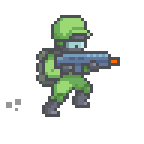

# 🎮 Gun Runner — Retro Browser Shooter



**Gun Runner** is a fast-paced, retro-style **side-scrolling shooter** built with **JavaScript**, **HTML Canvas**, and **Vite** ⚡.  
Jump, dash, and blast your way through waves of enemies in an endless world of increasing speed and chaos.

<br><br/>

<p align="center">
  
</p>

---

## 🚀 Gameplay Overview

Your character stays centered while the world scrolls toward you — jump over indestructible trees, destroy flying drones, and survive as long as possible.  
Each second alive means higher speed, tighter timing, and more intensity.

---

## ✨ Features

- 🦾 **Jump, Dash & Fire** — fluid movement and responsive controls.
- 💾 **Local High Score** — saved in your browser via `localStorage` for replayability.
- ⚡ **Dynamic Difficulty** — enemies and obstacles speed up the longer you last.
- 🕹️ **Multiple Playable Characters** — choose from 4 color variants.
- 🔊 **Retro Music & SFX** — toggle sound and music at any time.
- 🤖 **Animated Enemies** — drones explode in glorious sprite sheets.
- 😂 **“Deep” Lore** — mysterious backstories (totally serious) revealed in the info panel.

<p align="center">
  
</p>

---

## 🧩 Tech Stack

| Technology           | Purpose                                     |
| -------------------- | ------------------------------------------- |
| **JavaScript (ES6)** | Core game logic                             |
| **HTML Canvas API**  | Sprite rendering and motion                 |
| **CSS3**             | UI and layout styling                       |
| **Vite**             | Lightning-fast dev server and build bundler |

---

## 🧠 Key Files & Architecture

| File                      | Description                                                              |
| ------------------------- | ------------------------------------------------------------------------ |
| `game_view.js`            | Main controller — initializes the canvas, input listeners, and main loop |
| `game.js`                 | Core logic for rendering, physics, and collisions                        |
| `player.js`               | Handles user input, animation states, and interactions                   |
| `bullet.js`               | Defines projectile behavior and collision response                       |
| `enemy.js`                | Controls drone enemies, animations, and explosion logic                  |
| `obsticle.js`             | Defines indestructible obstacles                                         |
| `moving_object.js`        | Base class for objects with position and velocity                        |
| `animated_object.js`      | Extends movement to handle sprite animations                             |
| `static_sprite_object.js` | Handles static sprites drawn from images                                 |

---

## 🎞️ Smooth Sprite Animation

Animating sprites in Canvas was one of the biggest challenges.  
I solved this with an `AnimatedObject` subclass that handles frame-based drawing and timing.

---

## 💾 Persistent High Score

Without a backend, the high score is stored locally using the browser’s `localStorage`.

---

## 🧭 Roadmap

- ⚔️ **Weapon Pickups** — introduce multiple firing modes (shotgun, machine gun, etc.)
- 🌐 **Global Leaderboard** — integrate backend (FastAPI or Node) + MongoDB for shared scores
- 🏝️ **Dynamic Environments** — change backgrounds/enemies every 10,000 points

---

## 🎨 Assets & Credits

**Sprites & Art**

- [Plasma Drone](https://imonk.itch.io/plasma-drone) — Enemy sprites
- [Team Wars Platformer Battle](https://secrethideout.itch.io/team-wars-platformer-battle) — Player sprites
- [Pixilart Tree](https://www.pixilart.com/art/slay-the-king-tree-sprite-not-mine-came-from-a-stamp-a8230269374df1) — Obstacle
- [Pinterest Background](https://www.pinterest.com/pin/466896686362782654/) — Background
- [Kaylousberg Icons](https://kaylousberg.itch.io/) / [PixelArtMaker](http://pixelartmaker.com/art/a9f00c9246bf3dd) — UI icons

**Sounds**

- [Explosion](https://www.freesoundeffects.com/free-sounds/explosion-10070)
- [Victory Horns](https://freesound.org/people/FunWithSound/sounds/456966/)
- [Royalty-free Music](https://www.fesliyanstudios.com)

---

## 🧰 Installation & Local Setup

Clone the repo and start the game locally:

```bash
git clone https://github.com/yourusername/gun-runner.git
cd gun-runner
npm install
npm run dev
```

Then open the URL shown by Vite (usually [http://localhost:5173](http://localhost:5173)).

To build for production:

```bash
npm run build
```

---

## ⭐ Support the Project

If you enjoyed **Gun Runner**, please consider **starring** ⭐ the repository!  
Every star helps boost visibility and encourages new features and updates.

<p align="center">
  <b>💬 Feedback and pull requests are always welcome!</b>
</p>
